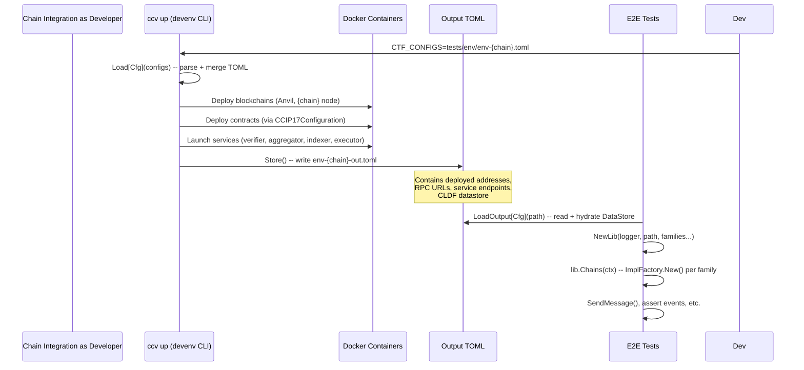

# Chainlink CCIP Stellar

## Tooling Commands

### Build contracts 

```shell
stellar contract build
```

### Generate Contract Interfaces

```shell
make generate-interfaces
```

Note: This command also builds the contracts.

⚠️ Because interfaces are also used within contracts as a crate, it is required that it can compile.

### Generate Bindings

```shell
make generate-bindings
```

Note: This command also builds the contracts and generates interfaces. It then uses the interfaces to generate the Go bindings.

---

## DevEnv Overview



---

## Running Tests

### Integration Tests

❕ Make sure the contracts are built and Go bindings are generated before running the tests. Running `make generate-bindings` is sufficient to have the pre-requisites necessary.

To run all integration tests, use the following command from the `tests/` directory (the `/tests` tree is its own Go module):

```shell
cd tests && go test ./integration/... -v -tags=integration -count=1 -p=1 -timeout=15m
```

To run a specific integration test, use the `-run` flag instead of specifying the file directly:

```shell
cd tests && go test ./integration/... -v -tags=integration -count=1 -p=1 -timeout=15m -run TestRmnRemote
```

> Note: This is required to make sure that a single test env setup is done when running multiple tests. This approach speeds up the spin up time to avoid having each test suite wait for 120-150 seconds for the local Stellar node to be ready.


### Contract Tests

To run the tests written in Rust (found in various `test.rs` files within `/contracts`), run the following command:

```shell
cargo test
```

To run a specific crate's tests, use the `-p` flag to specify the package:

```shell
cargo test -p ccvs-committee-verifier
```

### E2E Tests

❕ Make sure you have the environment (docker containers) already running including the necessary Verifier container which is specified in the [topology TOML file](./tests/env/env-stellar-evm.toml). To read more on setting up the E2E testing environment, see [the E2E setup guide document](./docs/running-e2e-tests.md).

Use the `make` command / alias to spin up the environment

```sh
make up
```

> This command is currently an alias for `cd tests && go run ./testutils/cmd/devenv up env/env-stellar-evm.toml`.

This will run the CCV CLI's `up` command and point the the default network topology TOML file. It will also generate (or overwrite) an `out` toplogy file (usually named `$TOPLOGY_FILE_NAME-out.toml` where `$TOPLOGY_FILE_NAME` is the file that was used as input for the `up` command).

Running the E2E tests is now as simple running regular Go tets with `cd tests && go test -v -timeout 15m ./e2e/...`

> The `/tests` directory is a separate Go module (`tests/go.mod`) that imports the production module and the e2e testing framework (CTF) via a local `replace`. This keeps the production module at the repo root free of direct CTF imports, so other repositories can import `chainlink-stellar` without inheriting CTF and its pinned version. Run all `go` commands for e2e, integration, and devenv code from inside `tests/`.