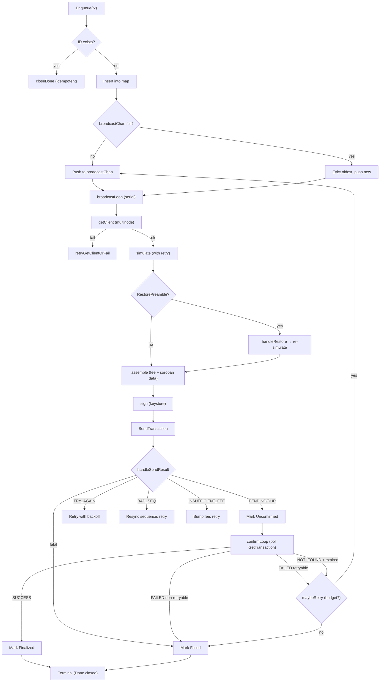
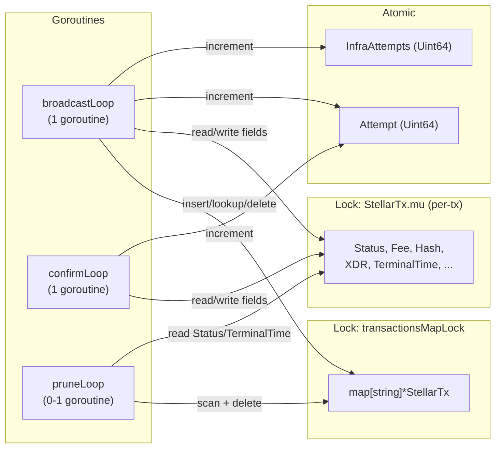

# Stellar TXM Audit Documentation

**Scope:** `relayer/txm/` - Stellar Transaction Manager

---

## 1. Architecture Overview

The Stellar TXM (`StellarTxm`) orchestrates the full lifecycle of Soroban transactions:

```
Enqueue → broadcastLoop → simulate → (restore) → assemble → sign → send → confirmLoop → terminal
```

### Transaction Lifecycle



### Goroutine & Lock Model



### Components

| Component | File | Responsibility |
|---|---|---|
| `StellarTxm` | `txm.go` | Main orchestrator: enqueue, broadcast, confirm, prune, status queries |
| `StellarTx` | `tx.go` | Per-tx state struct with locking contract |
| `TxStore` / `AccountStore` | `txstore.go` | Per-account sequence number tracking + unconfirmed tx set |
| `FeeStrategy` | `fee.go` | Inclusion fee calculation (geometric bump) + resource fee buffer |
| `feeTracker` | `fee_tracker.go` | Caches GetFeeStats P50/P90 percentiles to cap RPC rate |
| `broadcast.go` | `broadcast.go` | Simulate, assemble, sign, handleSendResult, error classification |
| `restore.go` | `restore.go` | RestoreFootprint transaction handling for archived ledger entries |
| `TxManagerConfig` | `config/txm.go` | TOML config struct with defaults from docs.toml |
| `metrics.go` | `metrics.go` | Prometheus metrics for broadcast/confirm/fee/retry/drop |

### Goroutine Model

- **broadcastLoop** (1 goroutine): drains `broadcastChan`, sorts by timestamp, calls `simulateAssembleSignAndSend` serially per tx.
- **confirmLoop** (1 goroutine): polls `GetTransaction` for all unconfirmed txs at `ConfirmPollInterval`, moves to terminal states.
- **pruneLoop** (0 or 1 goroutine): started only when `PruneInterval > 0`; evicts terminal txs past retention window.

All three are started in `Start()` and stopped via `close(s.stop)` + `s.done.Wait()` in `Close()`.

---

## 2. Concurrency Model

### Lock Structure

| Lock | Type | Guards |
|---|---|---|
| `transactionsMapLock` | `sync.RWMutex` | `map[string]*StellarTx` - insert, lookup, delete, prune scan |
| `StellarTx.mu` | `sync.RWMutex` (per-tx) | Mutable result-snapshot fields: Status, TerminalTime, BroadcastAt, TxHash, Fee, LedgerCloseTime, ResultXDR, ResultCode, ResultMetaXDR |
| `StellarTx.Attempt` | `atomic.Uint64` | Post-submit lifecycle retry counter |
| `StellarTx.InfraAttempts` | `atomic.Uint64` | getClient (RPC node selection) retry counter |
| `TxStore.lock` | `sync.RWMutex` (per-account) | Sequence numbers + unconfirmed set |
| `AccountStore.lock` | `sync.RWMutex` | Map of address → TxStore |
| `StellarTx.doneOnce` | `sync.Once` | Exactly-once close of `Done` channel |

### Lock Ordering Rule

**map→per-tx nesting is allowed ONLY in `pruneTerminal`.** Every other path takes the two locks non-nested (acquire one, release, then acquire the other).

- `pruneTerminal`: holds `transactionsMapLock.Lock()` → takes `tx.mu.RLock()` per entry inside the scan. Safe because no other path nests in the inverse direction.
- `updateTransactionStatus`: takes `tx.mu.Lock()` → releases → then `maybeEvictTerminalTx` takes `transactionsMapLock.Lock()`. Non-nested.
- `dropOldestForBackpressure`: takes `transactionsMapLock.Lock()` → releases → then `tx.mu.Lock()`. Non-nested.
- `GetStatus`/`GetTransactionResult`/`GetTransactionFee`: take `transactionsMapLock.RLock()` → release → then `tx.mu.RLock()`. Non-nested.

**Deadlock impossibility:** Deadlock requires two goroutines holding locks in opposite orders. With only one nesting direction (map→per-tx in prune), no inverse exists to deadlock against.

### Visibility Guarantee for `EnqueueAndWait` Waiters

`updateTransactionStatus` sequence:
1. `tx.mu.Lock()` → write Status + TerminalTime → `tx.mu.Unlock()` (publishes terminal fields)
2. `maybeEvictTerminalTx(tx)` (may delete from map - pointer stays valid via GC)
3. `closeDone(tx)` (closes `Done` channel)

Waiter: `<-tx.Done` → `txResult(tx)` → `tx.mu.RLock()` (reads terminal fields).

The `tx.mu.Unlock()` in step 1 is the happens-before barrier: channel close happens-after the unlock, and the waiter's receive happens-before its `RLock`. Terminal fields are guaranteed visible.

---

## 3. Transaction Lifecycle

### States

| Status | Meaning | Terminal? |
|---|---|---|
| `Pending` | Enqueued, not yet broadcast | No |
| `Unconfirmed` | Accepted by RPC (`SendTransaction` returned PENDING/DUPLICATE) | No |
| `Finalized` | Confirmed on-chain (SUCCESS) | Yes |
| `Failed` | Terminal failure (fatal error, max retries, on-chain failure, dropped) | Yes |

### Enqueue Path

1. `Enqueue` validates `Operations` (exactly 1), resolves `FromAddress`, validates address via `xdr.AddressToAccountId`.
2. Creates `StellarTx` with `Status: Pending`, `Done: make(chan struct{})`.
3. `enqueueTransaction`: inserts into map under `transactionsMapLock`, pushes to `broadcastChan`.
4. **Idempotent:** if `tx.ID` already exists, returns same ID without re-enqueueing. Closes `Done` on the existing tx.
5. **Backpressure:** if `broadcastChan` is full, drains the oldest queued tx, marks it `Failed` with `DropReasonChannelFullOldestEvicted`, and sends the new tx into the freed slot. If still full (concurrent race), drops the new tx with `DropReasonChannelFullNewRejected`.

### Broadcast Path (`simulateAssembleSignAndSend`)

1. `getClient(ctx)` - via multinode pool; on failure, `retryGetClientOrFail` (separate `InfraAttempts` budget).
2. Get/create `TxStore` for `FromAddress`; fetch on-chain sequence if first tx for this account.
3. Seed inclusion fee from `feeTracker` (P50 first attempt, P90 rebroadcasts), capped at `MaxInclusionFee`.
4. Reserve sequence via `txStore.GetNextSequence()`.
5. `prepareAndSimulateWithRetry`: fetch latest ledger, set `MaxLedger` bounds, build preliminary tx, simulate. Retries on retryable errors up to `MaxSimulateAttempts`.
6. **Restore handling:** if simulation returns `RestorePreamble`, submit a separate `RestoreFootprint` transaction, advance sequence, re-simulate. Only once per broadcast attempt (prevents infinite loop).
7. Assemble final tx with inclusion fee + resource fee buffer.
8. Sign via keystore.
9. `SendTransaction` - retry up to `MaxSubmitRetryAttempts` with `SubmitRetryDelay` backoff.
10. `handleSendResult` classifies the response:
    - PENDING/DUPLICATE → record hash, mark `Unconfirmed`, return.
    - TRY_AGAIN_LATER → retry without fee bump.
    - BAD_SEQ → resync sequence, retry.
    - INSUFFICIENT_FEE → bump inclusion fee, retry.
    - Error (fatal) → fail tx.
    - Error (retryable) → retry.

### Confirm Path (`checkUnconfirmed`)

Polls `GetTransaction` for every unconfirmed tx at `ConfirmPollInterval`:

- **SUCCESS:** extract actual `FeeCharged`, record result XDR/meta, mark `Finalized`.
- **FAILED (non-retryable):** mark `Failed` (terminal).
- **FAILED (retryable):** increment `Attempt`, re-enqueue via `maybeRetry` (up to `MaxTxRetryAttempts`).
- **NOT_FOUND + ledger expired:** confirm as failed, recycle sequence, retry if budget remains.
- **NOT_FOUND + wall-clock expired:** same as ledger expired (fallback when `GetLatestLedger` fails).
- **NOT_FOUND + not expired:** keep pending, count toward `totalPending` metric.

### Prune Path

- `PruneInterval > 0`: background goroutine scans at interval, evicts terminal txs past `PruneTxExpiration` (measured from `TerminalTime`).
- `PruneInterval == 0`: terminal txs evicted synchronously in `updateTransactionStatus` via `maybeEvictTerminalTx`.

---

## 4. Fee Strategy

Stellar fees have two independent components:

- **Inclusion fee:** market-based bid for validator priority. Geometrically bumped on retries: `baseFee × multiplier^attempt`, capped at `MaxInclusionFee`. Seeded from `GetFeeStats` P50 (first attempt) or P90 (rebroadcasts) via `feeTracker` cache.
- **Resource fee:** deterministic cost from simulation. Flat buffer (`ResourceFeeBuffer`) added to `MinResourceFee`. Not bumped - it's not negotiable.

Total fee = `inclusionFee + minResourceFee + resourceFeeBuffer`.

`feeTracker` caches `GetFeeStats` results at `FeeStatsPollInterval` to avoid calling the RPC on every broadcast. Zero interval disables caching (every fee decision calls `GetFeeStats`).

---

## 5. Sequence Number Management

`TxStore` (per-account) tracks:
- `nextSequence`: next sequence to allocate
- `unconfirmedSequences`: txs submitted but not yet confirmed
- `failedSequences`: recycled sequences available for reuse (gap plugging)
- `lastOnchainSequence`: last known on-chain sequence (from `ResyncNonce`)

**Key invariants:**
- Sequences are strictly sequential; a gap blocks all subsequent txs.
- `GetNextSequence` returns `min(nextSequence, min(failedSequences))` to plug gaps.
- `Release` returns an allocated-but-never-broadcast sequence to the failed pool (prevents sequence leaks on pre-broadcast failures).
- `ResyncNonce` is called before rebroadcast (attempt > 0) and after `bad_seq` errors to align with on-chain state. Must not be called between `GetNextSequence` and `AddUnconfirmed`.

---

## 6. Retry Budgets

Two separate retry budgets prevent infra outages from stealing lifecycle retries:

| Budget | Counter | Config | Exhaustion |
|---|---|---|---|
| Lifecycle | `Attempt` (atomic) | `MaxTxRetryAttempts` (default 5) | Post-submit failures: on-chain resource exhaustion, ledger timeout |
| Infra | `InfraAttempts` (atomic) | `MaxGetClientRetryAttempts` (default 10) | getClient (multinode RPC selection) failures |

`retryGetClientOrFail` handles getClient failures separately: increments `InfraAttempts`, re-enqueues after backoff, only fails with `ErrorReasonClientUnavailable` when `InfraAttempts` reaches `MaxGetClientRetryAttempts`.

---

## 7. Configuration

### Single Source of Truth

`docs.toml` is the single source of truth for all TXM defaults. `Resolve()` sources from `Defaults().TxManager` (parsed from docs.toml at `init()` time). No code-side `DefaultConfigSet` duplicate.

### Config Fields

| Field | Default | Purpose |
|---|---|---|
| `BroadcastChanSize` | 100 | Buffer size for broadcast channel |
| `ConfirmPollInterval` | 3s | GetTransaction poll rate |
| `BaseInclusionFee` | 100 stroops | Starting inclusion fee (MinBaseFee) |
| `MaxInclusionFee` | 100,000 stroops | Fee cap (0.01 XLM) |
| `FeeBumpMultiplier` | 1.5 | Geometric bump per retry |
| `ResourceFeeBuffer` | 15,000 stroops | Flat buffer over MinResourceFee |
| `RestoreFeeBuffer` | 10,000 stroops | Buffer for RestoreFootprint fee |
| `FeeStatsPollInterval` | 5s | GetFeeStats cache refresh rate |
| `MaxSimulateAttempts` | 3 | Simulate retries before terminal |
| `MaxSubmitRetryAttempts` | 10 | Send retries within one broadcast |
| `SubmitRetryDelay` | 3s | Delay between submit retries |
| `TxTimeoutSecs` | 300 (5 min) | Wall-clock fallback timeout |
| `LedgerBoundsOffset` | 50 | Ledgers ahead of latest for bounds |
| `MaxTxRetryAttempts` | 5 | Full lifecycle retries |
| `MaxGetClientRetryAttempts` | 10 | getClient (infra) retries |
| `MaxRestoreAttempts` | 3 | RestoreFootprint retries |
| `SimulationTerminalHints` | built-in list | Error substrings → terminal (no retry) |
| `SimulationRetryableHints` | built-in list | Error substrings → retry simulation |
| `PruneInterval` | 10m | Background prune scan rate (0 = sync eviction) |
| `PruneTxExpiration` | 2h | Terminal tx retention window |

### Config Tests

| Test | File | Guards |
|---|---|---|
| `TestDefaults_fieldsNotNil` | `docs_test.go` | docs.toml drift: missing field → nil after Defaults() |
| `TestDocsTOMLComplete` | `docs_test.go` | Struct drift: field in struct but not in docs.toml |
| `TestDefaults_RequestTimeout` | `docs_test.go` | `DefaultRequestTimeout` constant matches docs.toml |
| `TestDefaults_CopyIsolation` | `docs_test.go` | SetFrom deep-copies; no aliasing of package-level defaults |
| `TestResolve_AllDefaults` | `txm_test.go` | Resolve() fills correct values from Defaults() |
| `TestResolve_PartialOverride` | `txm_test.go` | User overrides preserved; unset fields get defaults |
| `TestResolve_ExplicitZero` | `txm_test.go` | Explicit 0 not overwritten by default |
| `TestResolve_CustomSimulationHintsAreAdditive` | `txm_test.go` | User hints merge with built-ins (additive, deduped) |
| `TestSetDefaults_MultiNode` | `config_test.go` | MultiNode defaults + explicit overrides |

---

## 8. Security Review

### Input Validation
- `Enqueue` validates `FromAddress` via `xdr.AddressToAccountId` before any downstream use. Invalid addresses rejected at entry point (defense regression test: `TestStellarTxm_Enqueue_Validation`).
- `len(req.Operations) != 1` enforced - only single-operation txs supported.
- `getSequenceNumber` validates address and decodes ledger entries defensively (no `MustAddress` panics; uses `AddressToAccountId` + `GetAccount` with error returns).

### No Sensitive Data in Logs
- Logs include txID, hash, fromAddress, error strings, fee amounts, attempt counts. No private keys, signatures, or secrets are logged.
- `GetContextedTxLogger` attaches txID + metadata to all log lines for traceability without exposing sensitive data.

### Error Handling
- All RPC errors are wrapped with `%w` for error chain preservation.
- `classifySubmitErrorCode` maps Stellar result codes to bounded `ErrorReason` labels - no unbounded user-controlled strings in metrics.
- `classifyFailedTransactionResult` decodes on-chain failure XDR safely via `xdr.SafeUnmarshalBase64` (no panic on malformed XDR).

### No Panic Surfaces
- `xdr.MustAddress` is not used anywhere in the TXM (replaced with `xdr.AddressToAccountId` which returns errors).
- `xdr.SafeUnmarshalBase64` used for all XDR decoding (returns error, not panic).
- `doneOnce.Do` structurally prevents double-close panic on `Done` channel.

---

## 9. Test Coverage

**Coverage:** 80.9% of statements (`go test -cover ./relayer/txm/...`)

### Test Files

| File | Tests |
|---|---|
| `txm_test.go` | Enqueue validation, idempotency, concurrent enqueue, GetStatus/Result/Fee, EnqueueAndWait, lifecycle, prune, TerminalTime, confirm loop, concurrency stress test |
| `broadcast_test.go` | Happy path, simulate error, simulate retry, TryAgainLater, BadSeq retry, insufficient fee bump, getClient retry, getClient exhaustion, duplicate, channel full eviction |
| `handle_send_test.go` | handleSendResult: PENDING/DUPLICATE/TRY_AGAIN_LATER/ERROR, stale field clearing |
| `fee_test.go` | FeeStrategy: Calculate, InclusionFee, SeedInclusionFee, BumpInclusionFee, clamping |
| `fee_tracker_test.go` | feeTracker: percentile caching, poll interval, concurrent access |
| `txstore_test.go` | TxStore: GetNextSequence, AddUnconfirmed, Confirm, Release, ResyncNonce, failed sequence recycling |
| `failed_result_test.go` | classifyFailedTransactionResult: retryable vs terminal classification |
| `metrics_test.go` | Metrics: broadcast, confirm, fee, retry, drop counters |
| `invoker_adapter_test.go` | InvokerAdapter: InvokeContract, SimulateContract, GetEvents |

### Race Detection
All tests pass under `go test -race`. The concurrency stress test (`TestStellarTxm_Concurrency_GetResultAndUpdateOnDifferentTxs`) exercises 20 concurrent readers + 20 concurrent writers on different txs + concurrent `pruneTerminal`, verifying no deadlock and no data races.

---


## 10. File Inventory

| File | Lines | Purpose |
|---|---|---|
| `txm.go` | ~1150 | Main TXM: enqueue, broadcast, confirm, prune, status, retry, simulate |
| `tx.go` | ~170 | StellarTx struct, TxRequest, TxResult, error/drop/retry reason types |
| `txstore.go` | ~200 | TxStore + AccountStore: sequence tracking |
| `broadcast.go` | ~250 | Simulate, assemble, sign, handleSendResult, error classification |
| `restore.go` | ~100 | RestoreFootprint transaction handling |
| `fee.go` | ~80 | FeeStrategy: inclusion + resource fee calculation |
| `fee_tracker.go` | ~80 | GetFeeStats percentile caching |
| `config/txm.go` | ~200 | TxManagerConfig struct, Resolve(), simulation hints |
| `metrics.go` | ~100 | Prometheus metrics |
| `invoker_adapter.go` | ~120 | bindings.Invoker adapter for TXM |
| `utils.go` | ~30 | Logger helpers |
| `network.go` | ~25 | NetworkPassphrase resolver (dead code - scheduled for removal) |

---

## 11. Verification

```
go build ./...              # clean
go vet ./relayer/txm/...    # clean
go test -race -count=1 -timeout 180s ./relayer/txm/...   # PASS, no races
go test -cover ./relayer/txm/...                          # 80.9% coverage
```
