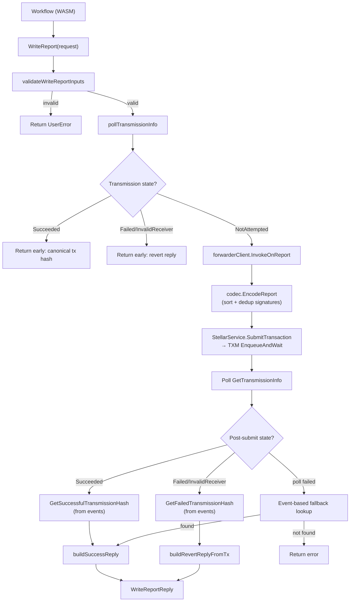

# Audit Documentation: Stellar Write Capability & Wiring

**Scope:** `chain_capabilities/stellar/` - CRE Write capability (WriteReport), forwarder client, codec, transmission scheduling, config, and wiring

---

## 1. Architecture Overview

The Stellar write capability is a CRE (Chainlink Runtime Environment) capability plugin that runs as a separate process (WASM module) and communicates with the Chainlink node via gRPC. It implements the `WriteReport` action: takes an OCR-generated report, submits it to the on-chain CRE Forwarder contract via the relayer's TXM, and polls for the canonical transmission outcome.

### WriteReport Flow



### Component Architecture

```mermaid
flowchart LR
    subgraph "Capability Plugin (WASM process)"
        Main["main.go\n(capabilityGRPCService)"]
        Actions["actions.Stellar"]
        WriteReport["writeReport"]
        FwdClient["forwarderClient"]
        Codec["creForwarderCodec"]
        TxHashRetriever["TxHashRetriever"]
        Config["config.Config"]
    end

    subgraph "Chainlink Node (relayer)"
        StellarService["StellarService"]
        TXM["StellarTxm"]
        Keystore["Keystore"]
    end

    subgraph "On-chain (Soroban)"
        Forwarder["CRE Forwarder\ncontract"]
        Receiver["Receiver\ncontract"]
    end

    Main -->|Initialise| Actions
    Actions -->|WriteReport| WriteReport
    WriteReport -->|InvokeOnReport| FwdClient
    FwdClient -->|EncodeReport| Codec
    FwdClient -->|SubmitTransaction| StellarService
    FwdClient -->|GetTransmissionInfo| StellarService
    FwdClient -->|GetEvents| StellarService
    WriteReport -->|GetHash| TxHashRetriever
    TxHashRetriever -->|GetReportProcessedEvents| FwdClient
    StellarService -->|EnqueueAndWait| TXM
    TXM -->|Sign| Keystore
    TXM -->|report()| Forwarder
    Forwarder -->|on_report| Receiver
```

### Data Flow

```
Workflow (WASM)
  → WriteReport(request: {ContractId, Report})
    → validateWriteReportInputs (report metadata, signatures, contract address)
    → pollTransmissionInfo (check if already transmitted by another DON node)
      → if Succeeded/Failed/InvalidReceiver: return early with canonical tx hash
      → if NotAttempted: proceed to submit
    → forwarderClient.InvokeOnReport(receiver, report)
      → resolveSigningAccount (relayer keystore)
      → creForwarderCodec.EncodeReport (build ScVal args)
      → StellarService.SubmitTransaction (→ TXM EnqueueAndWait)
    → poll post-submit transmission state
      → if Succeeded: GetSuccessfulTransmissionHash → buildSuccessReply
      → if Failed/InvalidReceiver: GetFailedTransmissionHash → buildRevertReply
    → return WriteReportReply {txHash, status, fee, ledgerCloseTime}
```

### Components

| Component | File | Responsibility |
|---|---|---|
| `Stellar` (actions) | `actions/actions.go` | Top-level capability: GetLatestLedger, WriteReport, ReadContract |
| `writeReport` | `actions/write_report.go` | WriteReport execution: validate, poll, submit, post-poll, build reply |
| `forwarderClient` | `actions/forwarder_client.go` | Forwarder contract interaction: InvokeOnReport, GetTransmissionInfo, GetReportProcessedEvents |
| `creForwarderCodec` | `actions/cre_forwarder_codec.go` | Encode/decode ScVal args for forwarder report() and get_transmission_info() |
| `TxHashRetriever` | `actions/tx_hash_retriever.go` | Fetch canonical tx hash from ReportProcessed events |
| `Config` | `config/config.go` | Capability config: forwarder address, delta stage, network, chain ID |
| `capabilityGRPCService` | `main.go` | gRPC server: Initialise (wiring), Start, Close, HealthReport |
| `height.Provider` | `height/` | Ledger height provider for consensus |
| `monitoring` | `monitoring/` | Telemetry: MessageBuilder, Processor, metrics |
| `metering` | `metering/` | Response metadata for billing |

---

## 2. WriteReport Lifecycle

### Phase 1: Input Validation (`validateWriteReportInputs`)

Validates before any chain interaction:
- `request` and `request.Report` non-nil
- `ContractId` non-empty and valid Stellar contract strkey (C…)
- `ReportContext` length == 96 bytes (OCR report context)
- At least one signature present
- Each signature length == 96 bytes (32-byte ed25519 pubkey + 64-byte signature)
- Report metadata decoded: version == 1, `ExecutionID` matches `metadata.WorkflowExecutionID`, `WorkflowOwner` matches (case-insensitive), `WorkflowName` matches (padded to 20 chars), `WorkflowID` matches

**Security note:** This validation runs before any RPC call. Invalid inputs are rejected with `caperrors.InvalidArgument` (user error, not retried).

### Phase 2: Pre-Submit Poll (`pollTransmissionInfo`)

Before submitting, checks if another DON node already transmitted:
- `queuePosition == 0` (first in schedule): quick retry poll - if already Succeeded/Failed/InvalidReceiver, return early.
- `queuePosition > 0`: wait until `queuePosition × DeltaStage`, polling with exponential backoff (100ms → 2s cap). If a terminal state is observed, return early without submitting.

This is the **delta-stage optimization**: later nodes in the DON schedule avoid duplicate submissions by observing earlier nodes' outcomes.

### Phase 3: Submit (`forwarderClient.InvokeOnReport`)

1. `resolveSigningAccount` - gets the relayer's signing account from `StellarService.GetSigningAccount`.
2. `creForwarderCodec.EncodeReport` - builds ScVal args: transmitter address, receiver address, raw report bytes, report context bytes, signature vector.
3. Signatures are sorted by public key (ascending) and deduplication is checked - matches the forwarder contract's strictly-ascending signer order requirement.
4. `StellarService.SubmitTransaction` - submits via the relayer's TXM (`EnqueueAndWait`), which handles simulate → assemble → sign → send → confirm.

### Phase 4: Post-Submit Poll

After submission, polls `GetTransmissionInfo` until the forwarder records the outcome:
- **Succeeded:** fetch canonical tx hash from `ReportProcessed` events, build success reply.
- **Failed/InvalidReceiver:** fetch canonical tx hash, build revert reply with error message.
- **Poll failure:** fall back to event-based tx hash lookup. If that also fails, return error.

### Phase 5: Reply Construction

`WriteReportReply` includes:
- `TxHash`: canonical on-chain tx hash (from events, not local TXM)
- `TxStatus`: Success / Failed / Fatal
- `TransactionFee`: actual fee charged (from TXM result)
- `BlockTimestamp`: ledger close time
- `ResultXDR` / `ResultMetaXDR`: on-chain result data

---

## 3. Signature Handling

### Encoding (`creForwarderCodec.EncodeReport`)

1. Each signature is validated: length == 96 bytes (32-byte pubkey + 64-byte ed25519 signature).
2. Signatures are sorted by public key (first 32 bytes) in ascending byte order.
3. Duplicate public keys are rejected.
4. Each signature is encoded as an ScVal map: `{public_key: Bytes, signature: Bytes}`.

**Security properties:**
- **Sorting + dedup** matches the forwarder contract's `verify_signatures` which requires strictly-ascending pubkey order. Without this, the contract would reject with `InvalidSignerOrder`.
- **Length validation** prevents malformed signatures from reaching the contract.
- The codec does **not** verify signatures itself that's the forwarder contract's job (`ed25519_verify`). The codec only encodes; the contract verifies.

### Report Metadata Validation

`validateWriteReportInputs` decodes the report metadata (first 109 bytes of `RawReport`) and verifies:
- Version == 1
- `ExecutionID` (32 bytes) matches the request metadata's `WorkflowExecutionID`
- `WorkflowOwner` (20 bytes) matches (case-insensitive)
- `WorkflowName` (10 bytes, padded) matches
- `WorkflowID` matches

This prevents a workflow from submitting a report generated by a different workflow  the report's embedded metadata must match the caller's metadata.

---

## 4. Transmission Scheduling

### Delta Stage

The DON uses a **transmission schedule** to avoid all nodes submitting simultaneously:
- Each node gets a `queuePosition` (0, 1, 2, ...) derived from a deterministic permutation seeded by the `TransmissionID.ScheduleKey()` (SHA-256 of receiver + workflowExecutionID + reportID).
- Node 0 submits immediately. Node N waits `N × DeltaStage` before submitting.
- During the wait, nodes poll `GetTransmissionInfo`. If a terminal state is observed, they skip submission.

**Security property:** The schedule key is deterministic across the DON (same receiver + report components → same key → same permutation). All nodes agree on the order without coordination.

### Report Size Limiting

`reportSizeLimit` (an `UpperBoundLimiter`) checks `RawReport` size against `cresettings.Default.PerWorkflow.ChainWrite.ReportSizeLimit` before submission. Prevents unbounded report sizes from reaching the chain.

---

## 5. Configuration & Wiring

### Capability Config (`config/config.go`)

```go
type Config struct {
    CREForwarderAddress         string        // C… strkey, validated
    ForwarderLookbackLedgers    int64         // default 100
    DeltaStage                  time.Duration // required > 0
    Network                     string        // required
    ChainID                     string        // required
    IsLocal                     bool
    ObservationPollerWorkersCount uint
    ObservationPollPeriod         time.Duration
    UnknownRequestsTTL            time.Duration
}
```

**Validation in `UnmarshalJSON`:**
- `Network`, `ChainID`, `CREForwarderAddress` required (non-empty)
- `CREForwarderAddress` validated as Stellar contract strkey via `strkey.Decode(strkey.VersionByteContract, ...)`
- `DeltaStage` must be > 0 (enforced in `Initialise`)

### Wiring (`main.go` `Initialise`)

1. Unmarshal config from `dependencies.Config`.
2. Resolve relayer via `RelayerSet.Get(network, chainID)`.
3. Get `StellarService` from relayer; verify signing account exists.
4. Set chain selector from config.
5. Initialize transmission scheduler with DON metadata from `CapabilityRegistry`.
6. Create consensus handler (poller-based), height provider, oracle.
7. Create `actions.NewStellar` with forwarder address, lookback ledgers, scheduler, consensus handler, monitoring.
8. Start poller, consensus handler, height provider, oracle.

**Key wiring invariants:**
- `CREForwarderAddress` is validated at config unmarshal time AND used as the forwarder contract address for all subsequent calls. No runtime override.
- The signing account is verified at init time (`GetSigningAccount` fails → capability won't start).
- `DeltaStage == 0` is rejected  the capability requires a non-zero delta stage for transmission scheduling.

---

## 6. Forwarder Client

### `InvokeOnReport`

1. Resolves the relayer's signing account (transmitter address).
2. Encodes report args via codec.
3. Calls `StellarService.SubmitTransaction` with `ContractId = forwarderAddress`, `Function = "report"`, `LedgerBoundsOffset = 20`.

**note:** The `ContractId` in the submit request is the **forwarder** address (not the receiver). The receiver is encoded inside the report args. This is correct the forwarder's `report()` function takes the receiver as an argument and dispatches to it.

### `GetTransmissionInfo`

Read-only simulation of `get_transmission_info` on the forwarder. Returns `{state, transmitter}`. No sequence number consumed, no signing required.

### `GetReportProcessedEvents`

Queries `GetEvents` with a topic filter for `forwarder_ReportProcessed` events matching the transmission ID. Used to find the canonical tx hash for a transmission.

---

## 7. TxHashRetriever

Retrieves the canonical on-chain tx hash from `ReportProcessed` events:

- **`GetSuccessfulTransmissionHash`**: returns the tx hash of the first successful event.
- **`GetFailedTransmissionHash`**: returns the tx hash of the earliest failed event. If a successful event is found among failed events, returns `ErrUnexpectedSuccessfulTransmission` (state inconsistency detected).

**Security property:** The tx hash comes from on-chain events (canonical), not from the local TXM submission. This ensures all DON nodes agree on the same tx hash even if multiple nodes submitted (duplicate submissions).

---

## 8. Test Coverage

### Test Files

| File | Tests |
|---|---|
| `actions_test.go` | WriteReport happy path, already-succeeded, already-failed, invalid receiver, validation errors, duplicate submission |
| `write_report_test.go` | Execute flow, polling, reply construction, metering |
| `forwarder_client_test.go` | InvokeOnReport, GetTransmissionInfo, GetReportProcessedEvents, error paths |
| `cre_forwarder_codec_test.go` | EncodeReport (sorting, dedup, validation), DecodeQueryTransmissionInfo, topic filter encoding |
| `tx_hash_retriever_test.go` | GetSuccessfulTransmissionHash, GetFailedTransmissionHash, event parsing, unexpected success detection |

---

## 9. File Inventory

| File | Lines | Purpose |
|---|---|---|
| `actions/actions.go` | ~200 | Top-level Stellar capability: NewStellar, GetLatestLedger, WriteReport entry |
| `actions/write_report.go` | ~450 | WriteReport execution: validate, poll, submit, post-poll, reply |
| `actions/forwarder_client.go` | ~200 | Forwarder contract client: InvokeOnReport, GetTransmissionInfo, GetEvents |
| `actions/cre_forwarder_codec.go` | ~250 | ScVal encoding/decoding for forwarder calls |
| `actions/tx_hash_retriever.go` | ~150 | Canonical tx hash from ReportProcessed events |
| `config/config.go` | ~70 | Capability config + validation |
| `main.go` | ~250 | gRPC server, Initialise wiring, lifecycle |
| `height/` | - | Ledger height provider for consensus |
| `monitoring/` | - | Telemetry (MessageBuilder, Processor, metrics) |
| `metering/` | - | Response metadata for billing |

---

## 10. Verification

```
go build ./...                          # clean
go vet ./chain_capabilities/stellar/... # clean
go test ./chain_capabilities/stellar/...# all pass
```
