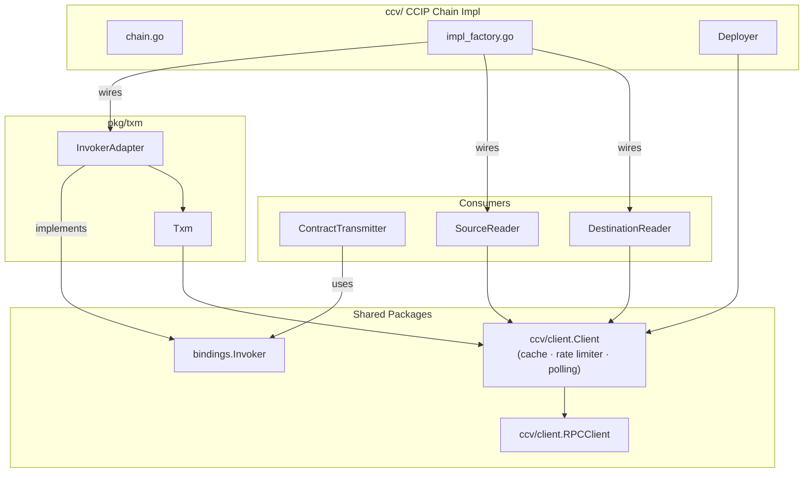

# Transaction Manager (TXM) Architecture

This document describes the architecture of the Stellar Transaction Manager (`pkg/txm/`),
the design decisions behind it, and how it integrates with the rest of the `chainlink-stellar`
codebase.

## Problem Statement

Before the TXM, all Soroban transaction logic (building, simulating, signing, submitting,
polling for confirmation) lived inside `deployment.Deployer`. This created several problems:

1. **Conflated concerns** — `Deployer` mixed one-time deployment logic with runtime
   transaction management that contract transmitters need continuously.
2. **No lifecycle management** — There was no Start/Close/Ready/HealthReport pattern,
   making it difficult to integrate with Chainlink's service supervision tree.
3. **No retry or expiry** — Transient Stellar RPC errors (`TRY_AGAIN_LATER`, sequence
   conflicts) were not retried, and there was no ledger-bounds-based expiry.
4. **Duplicated RPC logic** — `Deployer`, `SourceReader`, `DestinationReader`, and
   `StellarExecutionAttemptPoller` each created their own RPC client instances and
   duplicated low-level call patterns.

The TXM extracts runtime transaction management into a dedicated package with proper
lifecycle, retry, and observability, while a unified RPC client in `ccv/client/` removes
the duplicated RPC plumbing.

## Architecture Overview

TXM (`pkg/txm/`) and the CCIP Chain Impl (`ccv/`) are **peers** — neither depends on the
other. Both consume shared packages (`ccv/client` and `bindings`) for reusable behaviour.
The `InvokerAdapter` is a factory-level wiring choice, not a hard import dependency.



Key points:
- **TXM and ccv/ are sibling subgraphs**, both pointing into the shared `Client`/`RPCClient` layer.
- `ccv/client.Client` provides caching (latest ledger), rate limiting, and polling utilities shared by all consumers.
- The factory (`ImplFactory`) wires everything together; neither package imports the other.

## Design Decisions

### 1. TXM does not own ContractTransmitter

`ContractTransmitter` depends on `bindings.Invoker`, a generated interface that predates
the TXM. Rather than modifying `ContractTransmitter` or `bindings.Invoker` to accept a
`TxManager`, the integration happens via `InvokerAdapter` — a thin bridge that implements
`bindings.Invoker` by delegating to `TxManager.EnqueueAndWait`.

This keeps `ContractTransmitter` unchanged and pushes the wiring decision to the factory
layer (`ccv/accessors/factory.go`, `ccv/chain/impl_factory.go`), where either the legacy
`Deployer`-based invoker or the new TXM-backed `InvokerAdapter` can be injected.

**Trade-off:** `InvokerAdapter.InvokeContract` is synchronous (blocks until confirmed),
which matches the existing `bindings.Invoker` contract. Fully asynchronous fire-and-forget
usage goes through `TxManager.Enqueue` directly.

### 2. Unified RPCClient lives in ccv/client/, not pkg/txm/

The `RPCClient` interface is used by:
- `pkg/txm/` (TXM components)
- `ccv/source_reader/` (event polling)
- `ccv/destination_reader/` (execution attempt polling)
- `deployment/` (contract deployment)

Placing it in `ccv/client/` makes it a Stellar-wide concern rather than a TXM-internal
detail. This avoids `ccv/` importing from `pkg/txm/` and prevents circular dependencies.
The interface is the superset of all Soroban JSON-RPC methods used across the repository,
and `*rpcclient.Client` from the Stellar Go SDK satisfies it directly (verified by
compile-time assertion).

### 3. In-memory TxStore (not persistent)

The `TxStore` is an in-memory map guarded by `sync.RWMutex`, modeled after Solana TXM's
`PendingTxContext`. Stellar transactions have a short confirmation window (~5 minutes via
ledger bounds), so persistence across restarts is unnecessary — any in-flight transactions
will have expired by the time a node restarts. The `Reap` method garbage-collects terminal
entries to bound memory.

**Trade-off:** No crash recovery for in-flight transactions. Acceptable because
ledger-bounds expiry means the network itself garbage-collects stale transactions.

### 4. Sequence management extracted from Deployer

Stellar sequence numbers are analogous to EVM nonces. `SequenceStore` lazily fetches the
on-chain sequence via `GetLedgerEntries`, tracks it locally, and provides `NextSequence` /
`Confirm` / `Sync` methods. This replaces the inline sequence handling that was previously
embedded in `Deployer.invokeContract`.

The `Sync` method re-reads the on-chain value after a `tx_bad_seq` error, which can happen
when another process (or a previous retry) consumed a sequence number.

### 5. Fee estimation via Soroban simulation

Every transaction is simulated before submission via `SimulateTransaction`. The simulation
returns:
- **SorobanTransactionData** — resource limits and footprint
- **Authorization entries** — Soroban auth to attach to the operation
- **MinResourceFee** — minimum fee required by the network

`FeeEstimator.AssembleTransaction` applies these results to the original transaction and
adds a configurable `FeeBuffer` (default 10,000 stroops) to avoid fee-race rejections.

### 6. Ledger bounds for transaction expiry

Unlike EVM where transactions sit in a mempool indefinitely, Stellar transactions can
set `LedgerBounds.MaxLedger` to define a hard expiry. The TXM sets this to
`currentLedger + LedgerBoundsOffset` (default 50 ledgers ≈ 5 minutes at 6 seconds/ledger).

The confirmer checks `currentLedger > entry.MaxLedger` to detect expiry, which is
deterministic — once the network passes that ledger, the transaction can never be included.
A wall-clock timeout (`TxTimeout`, default 5 min) acts as a safety-net fallback and is
deliberately set higher than the ledger-bounds window to avoid premature expiry.

### 7. RestoreFootprint for expired persistent entries

Soroban persistent ledger entries have a TTL. If an entry expires between simulation and
submission, the transaction fails. When `AutoRestore` is enabled (default), the broadcaster
detects `RestorePreamble` in the simulation result and automatically submits a
`RestoreFootprint` transaction before retrying the original invocation.

This consumes an extra sequence number and requires waiting for the restore to confirm
before proceeding, but it's essential for long-lived contracts where TTLs may lapse between
deployments and runtime usage.

## Transaction Lifecycle

```
                    Enqueue
                       │
                       ▼
                ┌──────────┐
                │ PENDING  │
                └────┬─────┘
                     │ simulate → assemble → sign → send
                     │
            ┌────────┼─────────────┐
            │        │             │
            ▼        ▼             ▼
     ┌──────────┐  error?    TRY_AGAIN /
     │BROADCAST │  ────►     tx_bad_seq
     └────┬─────┘     │      ────►  retry
          │           │             (back to PENDING)
          │           ▼
          │     ┌──────────┐
          │     │  FAILED  │
          │     └──────────┘
          │
          │  confirmer polls GetTransaction
          │
     ┌────┼────────────────┐
     │    │                │
     ▼    ▼                ▼
SUCCESS  FAILED     NOT_FOUND +
  │       │         ledger > max
  ▼       ▼              │
┌──────────┐        ┌────▼─────┐
│CONFIRMED │        │ EXPIRED  │
└──────────┘        └──────────┘
```

States:

| State | Description |
|-------|-------------|
| **Pending** | Queued, not yet broadcast. Enters this state on `Enqueue` or after a retryable failure. |
| **Broadcast** | Submitted to the network (`SendTransaction` returned `PENDING` or `DUPLICATE`). |
| **Confirmed** | Included in a ledger with status `SUCCESS`. Terminal. |
| **Failed** | Rejected by the network or included with status `FAILED`. Terminal. |
| **Expired** | `currentLedger > MaxLedger` or wall-clock timeout exceeded without inclusion. Terminal. |

## Component Breakdown

### Txm (`txm.go`)

The orchestrator. Implements `TxManager` and manages the service lifecycle via an embedded
`services.StateMachine` from `chainlink-common` (handles double-start, close-before-start,
and health reporting). Uses `logger.Logger` from `chainlink-common` for structured logging
compatible with the Chainlink node pipeline. Spawns two background goroutines on `Start()`:

- **Broadcaster loop** — reads from the enqueue channel, calls `broadcaster.broadcast`,
  and handles retry logic (re-enqueue on retryable errors, sync sequence on conflicts).
- **Confirmer loop** — ticks at `ConfirmPollInterval` with ±20% jitter, delegating to
  `confirmer.checkAll`. Handles Layer 3 lifecycle retries via `maybeRetry`.

Additional responsibilities:
- **Pruning** — on each `Enqueue`, if `PruneInterval` has elapsed, calls `TxStore.Reap`
  to remove terminal entries older than `PruneThreshold`.
- **Query APIs** — `GetTransactionResult`, `GetTransactionFee`, `InflightCount` read
  from the in-memory store.

### Broadcaster (`broadcaster.go`)

Processes one transaction at a time through a three-phase pipeline with embedded retry
loops:

1. **Acquire sequence** — `SequenceStore.NextSequence` (prefers reusing failed sequences)
2. **Get latest ledger** — for computing `MaxLedger`
3. **Build operation** — `InvokeHostFunction` with the contract address, function, and args
4. **Layer 2: Simulate with retries** — `simulateWithRetries` handles `tx_bad_seq` during
   simulation by syncing the sequence from chain and retrying (up to `MaxSimulateAttempts`)
5. **RestoreFootprint** — if simulation indicates expired entries and `AutoRestore` is on.
   Consumes its own sequence, submits with a local retry loop for `TRY_AGAIN_LATER`
   (same `MaxSubmitAttempts`), waits for confirmation, then re-simulates the original tx.
6. **Assemble with fee bumping** — `FeeEstimator.AssembleTransaction` applies simulation
   data and geometric fee: `MinResourceFee + FeeBuffer * FeeBumpMultiplier^attempt`
7. **Sign** — `Keystore.Sign` with the network passphrase
8. **Layer 1: Submit with retries** — `submitWithRetries` handles `TRY_AGAIN_LATER` and
   transient network errors (up to `MaxSubmitAttempts`)
9. **Track sequence** — on success: `SequenceStore.AddUnconfirmed`; on any failure:
   `SequenceStore.Release`

### Confirmer (`confirmer.go`)

Polls all broadcast transactions on each tick with jitter:

1. **Get latest ledger** — single call per tick for all entries
2. **GetTransaction(hash)** — check each broadcast entry
3. **State transitions** (operates on `BroadcastSnapshot` copies, not live pointers):
   - `SUCCESS` → decode `FeeCharged` from `ResultXDR`, confirmed, `SequenceStore.Confirm(seq, consumed=true)`
   - `FAILED` → `maybeRetry`, `SequenceStore.Confirm(seq, consumed=true)` (on-chain failure)
   - `NOT_FOUND` + past ledger bounds → `maybeRetry`, `SequenceStore.Confirm(seq, consumed=false)`
   - `NOT_FOUND` + past wall-clock timeout → `maybeRetry`, same as above
4. **Layer 3: maybeRetry** — increments `entry.Attempt`, checks against `MaxRetries`, and
   re-enqueues on the broadcast channel for a full re-attempt with fresh simulation and
   bumped fee

### SequenceStore (`sequence_store.go`)

Thread-safe per-account sequence tracker with failed-sequence reuse, modeled after the
Aptos TxStore nonce tracking pattern:

- **`NextSequence`** — returns the next available sequence. Prefers reusing failed
  sequences (sorted ascending) over advancing the counter.
- **`AddUnconfirmed`** — marks a sequence as in-flight after successful broadcast.
- **`Confirm(seq, consumed)`** — `consumed=true` updates `lastOnChainSeq` (sequence was
  included in a ledger). `consumed=false` adds to `failedSeqs` for reuse (expired/dropped
  transactions whose sequences were never consumed).
- **`Release`** — returns a locally-allocated sequence that was never broadcast.
- **`Sync`** — re-reads the on-chain sequence and prunes stale `failedSeqs`.

### FeeEstimator (`fee_estimator.go`)

Wraps `SimulateTransaction` and parses the response into a `SimulationResult` struct
containing `SorobanTransactionData`, authorization entries, min fee, return value, and
optional `RestorePreamble`. `AssembleTransaction` applies these results to a pre-built
transaction with geometric fee bumping:

```
totalFee = MinResourceFee + CalculateInclusionFee(attempt, cfg)
inclusionFee = min(FeeBuffer * FeeBumpMultiplier^attempt, MaxInclusionFee)
```

### TxStore (`tx_store.go`)

In-memory map (`map[string]*txEntry`) with a secondary index by hash
(`map[string]string`). State transitions are guarded by `sync.RWMutex`. The `Done`
channel on each entry enables `EnqueueAndWait` to block until a terminal state is reached.
Read APIs (`BroadcastEntries`, `GetResult`, `GetFee`, `Status`) return snapshot copies
under the lock to prevent data races when callers read fields after the lock is released.
`Reap` removes terminal entries older than a threshold to bound memory. `Reap` is called
on each `Enqueue` if `PruneInterval` has elapsed.

### Keystore (`keystore.go`)

Abstraction over transaction signing with two implementations:

- **`KeypairKeystore`** — wraps `*keypair.Full` for direct ed25519 signing (CCIP path).
- **`LoopKeystoreSigner`** — wraps a `LoopKeystore` interface for the CRE keystore
  service path. Computes the signing hash via `tx.Hash`, calls `keystore.Sign`, and
  attaches the decorated signature to the transaction envelope.

### Metrics (`metrics.go`)

Prometheus counters and a gauge registered via `promauto`, with `chainID` and
`fromAddress` labels:

- Counters: `stellar_txm_broadcasted`, `_finalized`, `_error`, `_revert`, `_reject`,
  `_drop`, `_retry`, `_restore`
- Gauge: `stellar_txm_pending` (current enqueue channel depth)

Emit points: enqueue, broadcast, confirm, retry, error, prune. OTEL/Beholder meters can
be wired in when the TXM integrates into the CRE service lifecycle.

### InvokerAdapter (`invoker_adapter.go`)

Implements `bindings.Invoker` by delegating to `TxManager`:

- `InvokeContract` → `EnqueueAndWait` with a generated idempotency key
- `SimulateContract` → `EnqueueAndWait` with `SimulateOnly: true`
- `GetEvents` → direct `RPCClient.GetEvents` call (no transaction involved)

This is the bridge that allows `ContractTransmitter` and all generated contract clients
to use the TXM without code changes.

## Shared Stellar Primitives (ccv/client/)

### RPCClient interface

The `RPCClient` interface in `ccv/client/client.go` is the unified Soroban JSON-RPC
abstraction. It contains every method used across the repository:

| Method | Used By |
|--------|---------|
| `SimulateTransaction` | TXM (FeeEstimator), Deployer |
| `SendTransaction` | TXM (Broadcaster), Deployer |
| `GetTransaction` | TXM (Confirmer), DestinationReader |
| `GetLedgerEntries` | TXM (SequenceStore), SourceReader, Deployer |
| `GetEvents` | InvokerAdapter, SourceReader |
| `GetLatestLedger` | TXM (Broadcaster, Confirmer), ExecutionAttemptPoller |
| `GetLedgers` | Future use (block-range queries) |

`*rpcclient.Client` from the Stellar Go SDK satisfies this interface directly — no wrapper
is needed. A compile-time assertion (`var _ RPCClient = (*rpcclient.Client)(nil)`) enforces
this.

### Client struct — shared infrastructure

`ccv/client.Client` wraps `RPCClient` with three categories of shared infrastructure that
all consumers (TXM, SourceReader, DestinationReader, Deployer) benefit from when sharing a
single instance:

| Feature | Method | Description |
|---------|--------|-------------|
| **Latest-ledger cache** | `LatestLedger(ctx)` | Short-TTL cache (default 3s ≈ half a ledger close) that coalesces the most-called RPC method across all components. Protected by `sync.Mutex` to avoid thundering herd on expiry. |
| **Rate limiter** | `WaitRateLimit(ctx)` | Token-bucket rate limiter (`golang.org/x/time/rate`) protecting the Soroban RPC endpoint from overload when multiple pollers, TXM, and readers share one client. Default: 10 req/s, burst 20. |
| **Transaction polling** | `PollTransaction(ctx, hash, timeout)` | Polls `GetTransaction` until a terminal status or timeout, using the rate limiter. Replaces duplicated poll loops in the TXM broadcaster, confirmer, and test helpers. |

Configuration is via `ClientConfig`:

```go
type ClientConfig struct {
    LedgerCacheTTL  time.Duration // default 3s; 0 disables
    RateLimitPerSec float64       // default 10; 0 disables
    RateLimitBurst  int           // default 20
    PollInterval    time.Duration // default 1s
}
```

## Configuration Reference

| Parameter | Default | Description |
|-----------|---------|-------------|
| `MaxQueueSize` | 256 | Max pending tx requests in the enqueue channel |
| `ConfirmPollInterval` | 2s | How often the confirmer checks broadcast tx status (with ±20% jitter) |
| `TxTimeout` | 5m | Wall-clock safety-net timeout for tx confirmation (should exceed ledger-bounds window) |
| `LedgerBoundsOffset` | 50 | Ledgers into the future a tx is valid (~5 min at 6s/ledger) |
| `MaxRetries` | 3 | Layer 3 lifecycle retries (confirm loop re-enqueue) |
| `MaxSubmitAttempts` | 5 | Layer 1 HTTP submit retries per broadcast attempt |
| `SubmitRetryDelay` | 2s | Delay between submit retries |
| `MaxSimulateAttempts` | 5 | Layer 2 simulation retries for sequence races |
| `FeeBuffer` | 10,000 | Base inclusion fee (stroops) added to simulation's MinResourceFee |
| `FeeBumpMultiplier` | 1.5 | Geometric multiplier applied to inclusion fee per lifecycle retry |
| `MaxInclusionFee` | 1,000,000 | Safety cap on inclusion fee (stroops) |
| `AutoRestore` | true | Automatically restore expired persistent ledger entries |
| `PruneThreshold` | 5m | Age after which terminal transactions are removed from TxStore |
| `PruneInterval` | 30s | Minimum time between prune runs |

## Migration Path

The TXM is designed for incremental adoption:

1. **Phase 1 (done)** — `pkg/txm/` and `ccv/client/` RPCClient interface exist alongside
   the legacy `Deployer`. Both paths compile and can coexist.

2. **Phase 2** — Wire `InvokerAdapter` into `ccv/accessors/factory.go` behind a feature
   flag or config toggle. `ContractTransmitter` is unchanged; only the injected
   `bindings.Invoker` implementation switches.

3. **Phase 3** — Migrate `Deployer` to use `ccv/client.RPCClient` and `SequenceStore`
   instead of its own inline sequence/fee logic.

4. **Phase 4** — Migrate `SourceReader`, `DestinationReader`, and
   `ExecutionAttemptPoller` to accept an injected `*ccv/client.Client` (instead of bare
   `RPCClient`) so they benefit from the cached latest-ledger, rate limiting, and polling
   utilities.

## Comparison with Other Chain TXMs

The design is informed by existing Chainlink TXMs:

| Aspect | Solana TXM | Stellar TXM | EVM TXM |
|--------|-----------|-------------|---------|
| **Nonce/Sequence** | Blockhash-based | SequenceStore (account seq) | NonceTracker |
| **Expiry** | Blockhash expiry (~60s) | LedgerBounds (~5 min) | Gas price staleness |
| **Fee model** | Compute units + priority fee | SimulateTransaction + fee buffer | EIP-1559 dynamic |
| **Confirmation** | Signature status polling | GetTransaction polling | Receipt polling |
| **Store** | In-memory (PendingTxContext) | In-memory (TxStore) | SQL (persistent) |
| **RestoreFootprint** | N/A | Auto-restore expired entries | N/A |
