# smartcontractkit Go modules
## Main module

```mermaid
flowchart LR

	ccip-contract-examples/chains/evm
	click ccip-contract-examples/chains/evm href "https://github.com/smartcontractkit/ccip-contract-examples"
	ccip-owner-contracts
	click ccip-owner-contracts href "https://github.com/smartcontractkit/ccip-owner-contracts"
	chain-selectors
	click chain-selectors href "https://github.com/smartcontractkit/chain-selectors"
	chainlink-aptos
	click chainlink-aptos href "https://github.com/smartcontractkit/chainlink-aptos"
	chainlink-automation
	click chainlink-automation href "https://github.com/smartcontractkit/chainlink-automation"
	chainlink-canton
	click chainlink-canton href "https://github.com/smartcontractkit/chainlink-canton"
	chainlink-canton/contracts/v2
	click chainlink-canton/contracts/v2 href "https://github.com/smartcontractkit/chainlink-canton"
	chainlink-ccip/chains/evm --> ccip-contract-examples/chains/evm
	chainlink-ccip/chains/evm --> chainlink-ccip/deployment
	chainlink-ccip/chains/evm --> chainlink-deployments-framework
	chainlink-ccip/chains/evm --> chainlink-evm
	click chainlink-ccip/chains/evm href "https://github.com/smartcontractkit/chainlink-ccip"
	chainlink-ccip/chains/solana
	click chainlink-ccip/chains/solana href "https://github.com/smartcontractkit/chainlink-ccip"
	chainlink-ccip/chains/solana/gobindings
	click chainlink-ccip/chains/solana/gobindings href "https://github.com/smartcontractkit/chainlink-ccip"
	chainlink-ccip/deployment
	click chainlink-ccip/deployment href "https://github.com/smartcontractkit/chainlink-ccip"
	chainlink-ccv --> chainlink-ccip/chains/evm
	chainlink-ccv --> chainlink-protos/chainlink-ccv/committee-verifier
	chainlink-ccv --> chainlink-protos/chainlink-ccv/heartbeat
	chainlink-ccv --> chainlink-protos/chainlink-ccv/message-discovery
	chainlink-ccv --> chainlink-protos/chainlink-ccv/message-rules
	chainlink-ccv --> chainlink-protos/orchestrator
	chainlink-ccv --> chainlink-solana
	click chainlink-ccv href "https://github.com/smartcontractkit/chainlink-ccv"
	chainlink-ccv/deployment
	click chainlink-ccv/deployment href "https://github.com/smartcontractkit/chainlink-ccv"
	chainlink-common --> chainlink-common/pkg/chipingress
	chainlink-common --> chainlink-protos/billing/go
	chainlink-common --> chainlink-protos/cre/go
	chainlink-common --> chainlink-protos/linking-service/go
	chainlink-common --> chainlink-protos/metering/go
	chainlink-common --> chainlink-protos/node-platform
	chainlink-common --> chainlink-protos/storage-service
	chainlink-common --> chainlink-protos/workflows/go
	chainlink-common --> freeport
	chainlink-common --> grpc-proxy
	chainlink-common --> libocr
	click chainlink-common href "https://github.com/smartcontractkit/chainlink-common"
	chainlink-common/keystore --> chainlink-common
	chainlink-common/keystore --> smdkg
	chainlink-common/keystore --> wsrpc
	click chainlink-common/keystore href "https://github.com/smartcontractkit/chainlink-common"
	chainlink-common/pkg/chipingress
	click chainlink-common/pkg/chipingress href "https://github.com/smartcontractkit/chainlink-common"
	chainlink-data-streams
	click chainlink-data-streams href "https://github.com/smartcontractkit/chainlink-data-streams"
	chainlink-deployments-framework --> ccip-owner-contracts
	chainlink-deployments-framework --> chainlink-aptos
	chainlink-deployments-framework --> chainlink-canton
	chainlink-deployments-framework --> chainlink-ccip/chains/evm
	chainlink-deployments-framework --> chainlink-ccip/chains/solana
	chainlink-deployments-framework --> chainlink-ccip/chains/solana/gobindings
	chainlink-deployments-framework --> chainlink-protos/job-distributor
	chainlink-deployments-framework --> chainlink-protos/op-catalog
	chainlink-deployments-framework --> chainlink-stellar/bindings
	chainlink-deployments-framework --> chainlink-sui
	chainlink-deployments-framework --> chainlink-testing-framework/framework
	chainlink-deployments-framework --> chainlink-testing-framework/seth
	chainlink-deployments-framework --> chainlink-ton
	chainlink-deployments-framework --> chainlink-ton/cciplib
	chainlink-deployments-framework --> go-daml
	chainlink-deployments-framework --> mcms
	click chainlink-deployments-framework href "https://github.com/smartcontractkit/chainlink-deployments-framework"
	chainlink-evm --> chainlink-automation
	chainlink-evm --> chainlink-common/keystore
	chainlink-evm --> chainlink-data-streams
	chainlink-evm --> chainlink-evm/gethwrappers
	chainlink-evm --> chainlink-framework/capabilities
	chainlink-evm --> chainlink-framework/chains
	chainlink-evm --> chainlink-protos/svr
	chainlink-evm --> chainlink-tron/relayer
	click chainlink-evm href "https://github.com/smartcontractkit/chainlink-evm"
	chainlink-evm/gethwrappers --> chainlink-evm/gethwrappers/helpers
	click chainlink-evm/gethwrappers href "https://github.com/smartcontractkit/chainlink-evm"
	chainlink-evm/gethwrappers/helpers
	click chainlink-evm/gethwrappers/helpers href "https://github.com/smartcontractkit/chainlink-evm"
	chainlink-framework/capabilities
	click chainlink-framework/capabilities href "https://github.com/smartcontractkit/chainlink-framework"
	chainlink-framework/chains --> chainlink-framework/multinode
	click chainlink-framework/chains href "https://github.com/smartcontractkit/chainlink-framework"
	chainlink-framework/metrics --> chainlink-common
	click chainlink-framework/metrics href "https://github.com/smartcontractkit/chainlink-framework"
	chainlink-framework/multinode --> chainlink-framework/metrics
	click chainlink-framework/multinode href "https://github.com/smartcontractkit/chainlink-framework"
	chainlink-protos/billing/go
	click chainlink-protos/billing/go href "https://github.com/smartcontractkit/chainlink-protos"
	chainlink-protos/chainlink-ccv/committee-verifier --> chainlink-protos/chainlink-ccv/verifier
	click chainlink-protos/chainlink-ccv/committee-verifier href "https://github.com/smartcontractkit/chainlink-protos"
	chainlink-protos/chainlink-ccv/heartbeat
	click chainlink-protos/chainlink-ccv/heartbeat href "https://github.com/smartcontractkit/chainlink-protos"
	chainlink-protos/chainlink-ccv/message-discovery --> chainlink-protos/chainlink-ccv/verifier
	click chainlink-protos/chainlink-ccv/message-discovery href "https://github.com/smartcontractkit/chainlink-protos"
	chainlink-protos/chainlink-ccv/message-rules
	click chainlink-protos/chainlink-ccv/message-rules href "https://github.com/smartcontractkit/chainlink-protos"
	chainlink-protos/chainlink-ccv/verifier
	click chainlink-protos/chainlink-ccv/verifier href "https://github.com/smartcontractkit/chainlink-protos"
	chainlink-protos/cre/go --> chain-selectors
	click chainlink-protos/cre/go href "https://github.com/smartcontractkit/chainlink-protos"
	chainlink-protos/job-distributor
	click chainlink-protos/job-distributor href "https://github.com/smartcontractkit/chainlink-protos"
	chainlink-protos/linking-service/go
	click chainlink-protos/linking-service/go href "https://github.com/smartcontractkit/chainlink-protos"
	chainlink-protos/metering/go
	click chainlink-protos/metering/go href "https://github.com/smartcontractkit/chainlink-protos"
	chainlink-protos/node-platform
	click chainlink-protos/node-platform href "https://github.com/smartcontractkit/chainlink-protos"
	chainlink-protos/op-catalog
	click chainlink-protos/op-catalog href "https://github.com/smartcontractkit/chainlink-protos"
	chainlink-protos/orchestrator --> wsrpc
	click chainlink-protos/orchestrator href "https://github.com/smartcontractkit/chainlink-protos"
	chainlink-protos/storage-service
	click chainlink-protos/storage-service href "https://github.com/smartcontractkit/chainlink-protos"
	chainlink-protos/svr
	click chainlink-protos/svr href "https://github.com/smartcontractkit/chainlink-protos"
	chainlink-protos/workflows/go
	click chainlink-protos/workflows/go href "https://github.com/smartcontractkit/chainlink-protos"
	chainlink-solana
	click chainlink-solana href "https://github.com/smartcontractkit/chainlink-solana"
	chainlink-stellar --> chainlink-stellar/ccv
	click chainlink-stellar href "https://github.com/smartcontractkit/chainlink-stellar"
	chainlink-stellar/bindings
	click chainlink-stellar/bindings href "https://github.com/smartcontractkit/chainlink-stellar"
	chainlink-stellar/ccv --> chainlink-stellar/deployment
	chainlink-stellar/ccv --> chainlink-stellar/relayer
	click chainlink-stellar/ccv href "https://github.com/smartcontractkit/chainlink-stellar"
	chainlink-stellar/deployment --> chainlink-canton/contracts/v2
	chainlink-stellar/deployment --> chainlink-ccv
	chainlink-stellar/deployment --> chainlink-ccv/deployment
	click chainlink-stellar/deployment href "https://github.com/smartcontractkit/chainlink-stellar"
	chainlink-stellar/relayer
	click chainlink-stellar/relayer href "https://github.com/smartcontractkit/chainlink-stellar"
	chainlink-sui
	click chainlink-sui href "https://github.com/smartcontractkit/chainlink-sui"
	chainlink-testing-framework/framework
	click chainlink-testing-framework/framework href "https://github.com/smartcontractkit/chainlink-testing-framework"
	chainlink-testing-framework/seth
	click chainlink-testing-framework/seth href "https://github.com/smartcontractkit/chainlink-testing-framework"
	chainlink-ton
	click chainlink-ton href "https://github.com/smartcontractkit/chainlink-ton"
	chainlink-ton/cciplib
	click chainlink-ton/cciplib href "https://github.com/smartcontractkit/chainlink-ton"
	chainlink-tron/relayer
	click chainlink-tron/relayer href "https://github.com/smartcontractkit/chainlink-tron"
	freeport
	click freeport href "https://github.com/smartcontractkit/freeport"
	go-daml
	click go-daml href "https://github.com/smartcontractkit/go-daml"
	go-sumtype2
	click go-sumtype2 href "https://github.com/smartcontractkit/go-sumtype2"
	grpc-proxy
	click grpc-proxy href "https://github.com/smartcontractkit/grpc-proxy"
	libocr --> go-sumtype2
	click libocr href "https://github.com/smartcontractkit/libocr"
	mcms
	click mcms href "https://github.com/smartcontractkit/mcms"
	smdkg
	click smdkg href "https://github.com/smartcontractkit/smdkg"
	wsrpc
	click wsrpc href "https://github.com/smartcontractkit/wsrpc"

	subgraph chainlink-canton-repo[chainlink-canton]
		 chainlink-canton
		 chainlink-canton/contracts/v2
	end
	click chainlink-canton-repo href "https://github.com/smartcontractkit/chainlink-canton"

	subgraph chainlink-ccip-repo[chainlink-ccip]
		 chainlink-ccip/chains/evm
		 chainlink-ccip/chains/solana
		 chainlink-ccip/chains/solana/gobindings
		 chainlink-ccip/deployment
	end
	click chainlink-ccip-repo href "https://github.com/smartcontractkit/chainlink-ccip"

	subgraph chainlink-ccv-repo[chainlink-ccv]
		 chainlink-ccv
		 chainlink-ccv/deployment
	end
	click chainlink-ccv-repo href "https://github.com/smartcontractkit/chainlink-ccv"

	subgraph chainlink-common-repo[chainlink-common]
		 chainlink-common
		 chainlink-common/keystore
		 chainlink-common/pkg/chipingress
	end
	click chainlink-common-repo href "https://github.com/smartcontractkit/chainlink-common"

	subgraph chainlink-evm-repo[chainlink-evm]
		 chainlink-evm
		 chainlink-evm/gethwrappers
		 chainlink-evm/gethwrappers/helpers
	end
	click chainlink-evm-repo href "https://github.com/smartcontractkit/chainlink-evm"

	subgraph chainlink-framework-repo[chainlink-framework]
		 chainlink-framework/capabilities
		 chainlink-framework/chains
		 chainlink-framework/metrics
		 chainlink-framework/multinode
	end
	click chainlink-framework-repo href "https://github.com/smartcontractkit/chainlink-framework"

	subgraph chainlink-protos-repo[chainlink-protos]
		 chainlink-protos/billing/go
		 chainlink-protos/chainlink-ccv/committee-verifier
		 chainlink-protos/chainlink-ccv/heartbeat
		 chainlink-protos/chainlink-ccv/message-discovery
		 chainlink-protos/chainlink-ccv/message-rules
		 chainlink-protos/chainlink-ccv/verifier
		 chainlink-protos/cre/go
		 chainlink-protos/job-distributor
		 chainlink-protos/linking-service/go
		 chainlink-protos/metering/go
		 chainlink-protos/node-platform
		 chainlink-protos/op-catalog
		 chainlink-protos/orchestrator
		 chainlink-protos/storage-service
		 chainlink-protos/svr
		 chainlink-protos/workflows/go
	end
	click chainlink-protos-repo href "https://github.com/smartcontractkit/chainlink-protos"

	subgraph chainlink-stellar-repo[chainlink-stellar]
		 chainlink-stellar
		 chainlink-stellar/bindings
		 chainlink-stellar/ccv
		 chainlink-stellar/deployment
		 chainlink-stellar/relayer
	end
	click chainlink-stellar-repo href "https://github.com/smartcontractkit/chainlink-stellar"

	subgraph chainlink-testing-framework-repo[chainlink-testing-framework]
		 chainlink-testing-framework/framework
		 chainlink-testing-framework/seth
	end
	click chainlink-testing-framework-repo href "https://github.com/smartcontractkit/chainlink-testing-framework"

	subgraph chainlink-ton-repo[chainlink-ton]
		 chainlink-ton
		 chainlink-ton/cciplib
	end
	click chainlink-ton-repo href "https://github.com/smartcontractkit/chainlink-ton"

	classDef outline stroke-dasharray:6,fill:none;
	class chainlink-canton-repo,chainlink-ccip-repo,chainlink-ccv-repo,chainlink-common-repo,chainlink-evm-repo,chainlink-framework-repo,chainlink-protos-repo,chainlink-stellar-repo,chainlink-testing-framework-repo,chainlink-ton-repo outline
```

## All modules
```mermaid
flowchart LR

	ccip-contract-examples/chains/evm --> chainlink-ccip
	click ccip-contract-examples/chains/evm href "https://github.com/smartcontractkit/ccip-contract-examples"
	ccip-owner-contracts
	click ccip-owner-contracts href "https://github.com/smartcontractkit/ccip-owner-contracts"
	chain-selectors
	click chain-selectors href "https://github.com/smartcontractkit/chain-selectors"
	chainlink-aptos --> chainlink-common
	click chainlink-aptos href "https://github.com/smartcontractkit/chainlink-aptos"
	chainlink-automation
	click chainlink-automation href "https://github.com/smartcontractkit/chainlink-automation"
	chainlink-canton
	click chainlink-canton href "https://github.com/smartcontractkit/chainlink-canton"
	chainlink-canton/contracts/v2 --> go-daml
	click chainlink-canton/contracts/v2 href "https://github.com/smartcontractkit/chainlink-canton"
	chainlink-ccip
	click chainlink-ccip href "https://github.com/smartcontractkit/chainlink-ccip"
	chainlink-ccip/ccv/chains/evm
	click chainlink-ccip/ccv/chains/evm href "https://github.com/smartcontractkit/chainlink-ccip"
	chainlink-ccip/chains/evm --> ccip-contract-examples/chains/evm
	click chainlink-ccip/chains/evm href "https://github.com/smartcontractkit/chainlink-ccip"
	chainlink-ccip/chains/solana --> chainlink-ccip/chains/solana/gobindings
	chainlink-ccip/chains/solana --> chainlink-common
	click chainlink-ccip/chains/solana href "https://github.com/smartcontractkit/chainlink-ccip"
	chainlink-ccip/chains/solana/gobindings
	click chainlink-ccip/chains/solana/gobindings href "https://github.com/smartcontractkit/chainlink-ccip"
	chainlink-ccip/deployment
	click chainlink-ccip/deployment href "https://github.com/smartcontractkit/chainlink-ccip"
	chainlink-ccv --> chainlink-ccip/chains/evm
	chainlink-ccv --> chainlink-evm
	chainlink-ccv --> chainlink-protos/chainlink-ccv/committee-verifier
	chainlink-ccv --> chainlink-protos/chainlink-ccv/heartbeat
	chainlink-ccv --> chainlink-protos/chainlink-ccv/message-discovery
	chainlink-ccv --> chainlink-protos/chainlink-ccv/message-rules
	chainlink-ccv --> chainlink-protos/orchestrator
	chainlink-ccv --> chainlink-solana
	chainlink-ccv --> chainlink-testing-framework/framework
	click chainlink-ccv href "https://github.com/smartcontractkit/chainlink-ccv"
	chainlink-ccv/build/devenv --> chainlink-ccv/integration/evm
	chainlink-ccv/build/devenv --> chainlink/deployment
	click chainlink-ccv/build/devenv href "https://github.com/smartcontractkit/chainlink-ccv"
	chainlink-ccv/deployment
	click chainlink-ccv/deployment href "https://github.com/smartcontractkit/chainlink-ccv"
	chainlink-ccv/integration/evm
	click chainlink-ccv/integration/evm href "https://github.com/smartcontractkit/chainlink-ccv"
	chainlink-common --> chainlink-common/pkg/chipingress
	chainlink-common --> chainlink-protos/billing/go
	chainlink-common --> chainlink-protos/cre/go
	chainlink-common --> chainlink-protos/linking-service/go
	chainlink-common --> chainlink-protos/metering/go
	chainlink-common --> chainlink-protos/node-platform
	chainlink-common --> chainlink-protos/storage-service
	chainlink-common --> chainlink-protos/workflows/go
	chainlink-common --> freeport
	chainlink-common --> grpc-proxy
	chainlink-common --> libocr
	click chainlink-common href "https://github.com/smartcontractkit/chainlink-common"
	chainlink-common/keystore --> chainlink-common
	chainlink-common/keystore --> smdkg
	chainlink-common/keystore --> wsrpc
	click chainlink-common/keystore href "https://github.com/smartcontractkit/chainlink-common"
	chainlink-common/pkg/chipingress
	click chainlink-common/pkg/chipingress href "https://github.com/smartcontractkit/chainlink-common"
	chainlink-common/pkg/monitoring --> chainlink-common
	chainlink-common/pkg/monitoring --> chainlink-common/pkg/values
	click chainlink-common/pkg/monitoring href "https://github.com/smartcontractkit/chainlink-common"
	chainlink-common/pkg/values
	click chainlink-common/pkg/values href "https://github.com/smartcontractkit/chainlink-common"
	chainlink-data-streams
	click chainlink-data-streams href "https://github.com/smartcontractkit/chainlink-data-streams"
	chainlink-deployments-framework --> ccip-owner-contracts
	chainlink-deployments-framework --> chainlink-protos/op-catalog
	chainlink-deployments-framework --> chainlink-testing-framework/seth
	chainlink-deployments-framework --> mcms
	click chainlink-deployments-framework href "https://github.com/smartcontractkit/chainlink-deployments-framework"
	chainlink-evm --> chainlink-automation
	chainlink-evm --> chainlink-common/keystore
	chainlink-evm --> chainlink-data-streams
	chainlink-evm --> chainlink-evm/gethwrappers
	chainlink-evm --> chainlink-framework/capabilities
	chainlink-evm --> chainlink-framework/chains
	chainlink-evm --> chainlink-protos/svr
	chainlink-evm --> chainlink-tron/relayer
	click chainlink-evm href "https://github.com/smartcontractkit/chainlink-evm"
	chainlink-evm/contracts/cre/gobindings
	click chainlink-evm/contracts/cre/gobindings href "https://github.com/smartcontractkit/chainlink-evm"
	chainlink-evm/gethwrappers --> chainlink-evm/gethwrappers/helpers
	click chainlink-evm/gethwrappers href "https://github.com/smartcontractkit/chainlink-evm"
	chainlink-evm/gethwrappers/helpers
	click chainlink-evm/gethwrappers/helpers href "https://github.com/smartcontractkit/chainlink-evm"
	chainlink-feeds
	click chainlink-feeds href "https://github.com/smartcontractkit/chainlink-feeds"
	chainlink-framework/capabilities
	click chainlink-framework/capabilities href "https://github.com/smartcontractkit/chainlink-framework"
	chainlink-framework/chains --> chainlink-framework/multinode
	click chainlink-framework/chains href "https://github.com/smartcontractkit/chainlink-framework"
	chainlink-framework/metrics --> chainlink-common
	click chainlink-framework/metrics href "https://github.com/smartcontractkit/chainlink-framework"
	chainlink-framework/multinode --> chainlink-framework/metrics
	click chainlink-framework/multinode href "https://github.com/smartcontractkit/chainlink-framework"
	chainlink-protos/billing/go
	click chainlink-protos/billing/go href "https://github.com/smartcontractkit/chainlink-protos"
	chainlink-protos/chainlink-ccv/committee-verifier --> chainlink-protos/chainlink-ccv/verifier
	click chainlink-protos/chainlink-ccv/committee-verifier href "https://github.com/smartcontractkit/chainlink-protos"
	chainlink-protos/chainlink-ccv/heartbeat
	click chainlink-protos/chainlink-ccv/heartbeat href "https://github.com/smartcontractkit/chainlink-protos"
	chainlink-protos/chainlink-ccv/message-discovery --> chainlink-protos/chainlink-ccv/verifier
	click chainlink-protos/chainlink-ccv/message-discovery href "https://github.com/smartcontractkit/chainlink-protos"
	chainlink-protos/chainlink-ccv/message-rules
	click chainlink-protos/chainlink-ccv/message-rules href "https://github.com/smartcontractkit/chainlink-protos"
	chainlink-protos/chainlink-ccv/verifier
	click chainlink-protos/chainlink-ccv/verifier href "https://github.com/smartcontractkit/chainlink-protos"
	chainlink-protos/cre/go --> chain-selectors
	click chainlink-protos/cre/go href "https://github.com/smartcontractkit/chainlink-protos"
	chainlink-protos/job-distributor
	click chainlink-protos/job-distributor href "https://github.com/smartcontractkit/chainlink-protos"
	chainlink-protos/linking-service/go
	click chainlink-protos/linking-service/go href "https://github.com/smartcontractkit/chainlink-protos"
	chainlink-protos/metering/go
	click chainlink-protos/metering/go href "https://github.com/smartcontractkit/chainlink-protos"
	chainlink-protos/node-platform
	click chainlink-protos/node-platform href "https://github.com/smartcontractkit/chainlink-protos"
	chainlink-protos/op-catalog
	click chainlink-protos/op-catalog href "https://github.com/smartcontractkit/chainlink-protos"
	chainlink-protos/orchestrator --> wsrpc
	click chainlink-protos/orchestrator href "https://github.com/smartcontractkit/chainlink-protos"
	chainlink-protos/rmn/v1.6/go
	click chainlink-protos/rmn/v1.6/go href "https://github.com/smartcontractkit/chainlink-protos"
	chainlink-protos/storage-service
	click chainlink-protos/storage-service href "https://github.com/smartcontractkit/chainlink-protos"
	chainlink-protos/svr
	click chainlink-protos/svr href "https://github.com/smartcontractkit/chainlink-protos"
	chainlink-protos/workflows/go
	click chainlink-protos/workflows/go href "https://github.com/smartcontractkit/chainlink-protos"
	chainlink-solana
	click chainlink-solana href "https://github.com/smartcontractkit/chainlink-solana"
	chainlink-stellar --> chainlink-stellar/ccv
	click chainlink-stellar href "https://github.com/smartcontractkit/chainlink-stellar"
	chainlink-stellar/bindings
	click chainlink-stellar/bindings href "https://github.com/smartcontractkit/chainlink-stellar"
	chainlink-stellar/ccv --> chainlink-stellar/deployment
	chainlink-stellar/ccv --> chainlink-stellar/relayer
	click chainlink-stellar/ccv href "https://github.com/smartcontractkit/chainlink-stellar"
	chainlink-stellar/deployment --> chainlink-ccv
	chainlink-stellar/deployment --> chainlink-ccv/deployment
	click chainlink-stellar/deployment href "https://github.com/smartcontractkit/chainlink-stellar"
	chainlink-stellar/relayer --> chainlink-common/pkg/monitoring
	chainlink-stellar/relayer --> chainlink-framework/multinode
	chainlink-stellar/relayer --> chainlink-stellar/bindings
	click chainlink-stellar/relayer href "https://github.com/smartcontractkit/chainlink-stellar"
	chainlink-stellar/tests --> chainlink-ccv/build/devenv
	chainlink-stellar/tests --> chainlink-stellar/ccv
	click chainlink-stellar/tests href "https://github.com/smartcontractkit/chainlink-stellar"
	chainlink-sui --> chainlink-aptos
	chainlink-sui --> chainlink-ccip
	click chainlink-sui href "https://github.com/smartcontractkit/chainlink-sui"
	chainlink-sui/deployment
	click chainlink-sui/deployment href "https://github.com/smartcontractkit/chainlink-sui"
	chainlink-testing-framework/framework --> chainlink-testing-framework/wasp
	click chainlink-testing-framework/framework href "https://github.com/smartcontractkit/chainlink-testing-framework"
	chainlink-testing-framework/lib
	click chainlink-testing-framework/lib href "https://github.com/smartcontractkit/chainlink-testing-framework"
	chainlink-testing-framework/lib/grafana
	click chainlink-testing-framework/lib/grafana href "https://github.com/smartcontractkit/chainlink-testing-framework"
	chainlink-testing-framework/parrot
	click chainlink-testing-framework/parrot href "https://github.com/smartcontractkit/chainlink-testing-framework"
	chainlink-testing-framework/seth
	click chainlink-testing-framework/seth href "https://github.com/smartcontractkit/chainlink-testing-framework"
	chainlink-testing-framework/wasp --> chainlink-testing-framework/lib
	chainlink-testing-framework/wasp --> chainlink-testing-framework/lib/grafana
	click chainlink-testing-framework/wasp href "https://github.com/smartcontractkit/chainlink-testing-framework"
	chainlink-ton --> chainlink-ccip
	chainlink-ton --> chainlink-common/pkg/monitoring
	chainlink-ton --> chainlink-framework/metrics
	chainlink-ton --> chainlink-ton/cciplib
	click chainlink-ton href "https://github.com/smartcontractkit/chainlink-ton"
	chainlink-ton/cciplib --> chainlink-common
	click chainlink-ton/cciplib href "https://github.com/smartcontractkit/chainlink-ton"
	chainlink-ton/deployment
	click chainlink-ton/deployment href "https://github.com/smartcontractkit/chainlink-ton"
	chainlink-tron/relayer --> chainlink-common
	click chainlink-tron/relayer href "https://github.com/smartcontractkit/chainlink-tron"
	chainlink/deployment --> ccip-contract-examples/chains/evm
	chainlink/deployment --> chainlink-ccip/ccv/chains/evm
	chainlink/deployment --> chainlink-ccv
	chainlink/deployment --> chainlink-evm/contracts/cre/gobindings
	chainlink/deployment --> chainlink-sui/deployment
	chainlink/deployment --> chainlink-testing-framework/parrot
	chainlink/deployment --> chainlink-ton/deployment
	chainlink/deployment --> chainlink/v2
	click chainlink/deployment href "https://github.com/smartcontractkit/chainlink"
	chainlink/v2 --> chainlink-ccip/chains/solana
	chainlink/v2 --> chainlink-evm
	chainlink/v2 --> chainlink-feeds
	chainlink/v2 --> chainlink-protos/orchestrator
	chainlink/v2 --> chainlink-protos/rmn/v1.6/go
	chainlink/v2 --> chainlink-solana
	chainlink/v2 --> chainlink-sui
	chainlink/v2 --> chainlink-ton
	chainlink/v2 --> cre-sdk-go
	chainlink/v2 --> cre-sdk-go/capabilities/networking/http
	chainlink/v2 --> cre-sdk-go/capabilities/scheduler/cron
	chainlink/v2 --> quarantine
	chainlink/v2 --> tdh2/go/ocr2/decryptionplugin
	chainlink/v2 --> tdh2/go/tdh2
	click chainlink/v2 href "https://github.com/smartcontractkit/chainlink"
	cre-sdk-go
	click cre-sdk-go href "https://github.com/smartcontractkit/cre-sdk-go"
	cre-sdk-go/capabilities/networking/http
	click cre-sdk-go/capabilities/networking/http href "https://github.com/smartcontractkit/cre-sdk-go"
	cre-sdk-go/capabilities/scheduler/cron
	click cre-sdk-go/capabilities/scheduler/cron href "https://github.com/smartcontractkit/cre-sdk-go"
	freeport
	click freeport href "https://github.com/smartcontractkit/freeport"
	go-daml --> freeport
	click go-daml href "https://github.com/smartcontractkit/go-daml"
	go-sumtype2
	click go-sumtype2 href "https://github.com/smartcontractkit/go-sumtype2"
	grpc-proxy
	click grpc-proxy href "https://github.com/smartcontractkit/grpc-proxy"
	libocr --> go-sumtype2
	click libocr href "https://github.com/smartcontractkit/libocr"
	mcms --> chainlink-canton
	mcms --> chainlink-canton/contracts/v2
	mcms --> chainlink-ccip/chains/solana
	mcms --> chainlink-ccip/deployment
	mcms --> chainlink-deployments-framework
	mcms --> chainlink-protos/job-distributor
	mcms --> chainlink-stellar
	mcms --> chainlink-sui
	mcms --> chainlink-ton
	click mcms href "https://github.com/smartcontractkit/mcms"
	quarantine
	click quarantine href "https://github.com/smartcontractkit/quarantine"
	smdkg
	click smdkg href "https://github.com/smartcontractkit/smdkg"
	tdh2/go/ocr2/decryptionplugin
	click tdh2/go/ocr2/decryptionplugin href "https://github.com/smartcontractkit/tdh2"
	tdh2/go/tdh2
	click tdh2/go/tdh2 href "https://github.com/smartcontractkit/tdh2"
	wsrpc
	click wsrpc href "https://github.com/smartcontractkit/wsrpc"

	subgraph chainlink-repo[chainlink]
		 chainlink/deployment
		 chainlink/v2
	end
	click chainlink-repo href "https://github.com/smartcontractkit/chainlink"

	subgraph chainlink-canton-repo[chainlink-canton]
		 chainlink-canton
		 chainlink-canton/contracts/v2
	end
	click chainlink-canton-repo href "https://github.com/smartcontractkit/chainlink-canton"

	subgraph chainlink-ccip-repo[chainlink-ccip]
		 chainlink-ccip
		 chainlink-ccip/ccv/chains/evm
		 chainlink-ccip/chains/evm
		 chainlink-ccip/chains/solana
		 chainlink-ccip/chains/solana/gobindings
		 chainlink-ccip/deployment
	end
	click chainlink-ccip-repo href "https://github.com/smartcontractkit/chainlink-ccip"

	subgraph chainlink-ccv-repo[chainlink-ccv]
		 chainlink-ccv
		 chainlink-ccv/build/devenv
		 chainlink-ccv/deployment
		 chainlink-ccv/integration/evm
	end
	click chainlink-ccv-repo href "https://github.com/smartcontractkit/chainlink-ccv"

	subgraph chainlink-common-repo[chainlink-common]
		 chainlink-common
		 chainlink-common/keystore
		 chainlink-common/pkg/chipingress
		 chainlink-common/pkg/monitoring
		 chainlink-common/pkg/values
	end
	click chainlink-common-repo href "https://github.com/smartcontractkit/chainlink-common"

	subgraph chainlink-evm-repo[chainlink-evm]
		 chainlink-evm
		 chainlink-evm/contracts/cre/gobindings
		 chainlink-evm/gethwrappers
		 chainlink-evm/gethwrappers/helpers
	end
	click chainlink-evm-repo href "https://github.com/smartcontractkit/chainlink-evm"

	subgraph chainlink-framework-repo[chainlink-framework]
		 chainlink-framework/capabilities
		 chainlink-framework/chains
		 chainlink-framework/metrics
		 chainlink-framework/multinode
	end
	click chainlink-framework-repo href "https://github.com/smartcontractkit/chainlink-framework"

	subgraph chainlink-protos-repo[chainlink-protos]
		 chainlink-protos/billing/go
		 chainlink-protos/chainlink-ccv/committee-verifier
		 chainlink-protos/chainlink-ccv/heartbeat
		 chainlink-protos/chainlink-ccv/message-discovery
		 chainlink-protos/chainlink-ccv/message-rules
		 chainlink-protos/chainlink-ccv/verifier
		 chainlink-protos/cre/go
		 chainlink-protos/job-distributor
		 chainlink-protos/linking-service/go
		 chainlink-protos/metering/go
		 chainlink-protos/node-platform
		 chainlink-protos/op-catalog
		 chainlink-protos/orchestrator
		 chainlink-protos/rmn/v1.6/go
		 chainlink-protos/storage-service
		 chainlink-protos/svr
		 chainlink-protos/workflows/go
	end
	click chainlink-protos-repo href "https://github.com/smartcontractkit/chainlink-protos"

	subgraph chainlink-stellar-repo[chainlink-stellar]
		 chainlink-stellar
		 chainlink-stellar/bindings
		 chainlink-stellar/ccv
		 chainlink-stellar/deployment
		 chainlink-stellar/relayer
		 chainlink-stellar/tests
	end
	click chainlink-stellar-repo href "https://github.com/smartcontractkit/chainlink-stellar"

	subgraph chainlink-sui-repo[chainlink-sui]
		 chainlink-sui
		 chainlink-sui/deployment
	end
	click chainlink-sui-repo href "https://github.com/smartcontractkit/chainlink-sui"

	subgraph chainlink-testing-framework-repo[chainlink-testing-framework]
		 chainlink-testing-framework/framework
		 chainlink-testing-framework/lib
		 chainlink-testing-framework/lib/grafana
		 chainlink-testing-framework/parrot
		 chainlink-testing-framework/seth
		 chainlink-testing-framework/wasp
	end
	click chainlink-testing-framework-repo href "https://github.com/smartcontractkit/chainlink-testing-framework"

	subgraph chainlink-ton-repo[chainlink-ton]
		 chainlink-ton
		 chainlink-ton/cciplib
		 chainlink-ton/deployment
	end
	click chainlink-ton-repo href "https://github.com/smartcontractkit/chainlink-ton"

	subgraph cre-sdk-go-repo[cre-sdk-go]
		 cre-sdk-go
		 cre-sdk-go/capabilities/networking/http
		 cre-sdk-go/capabilities/scheduler/cron
	end
	click cre-sdk-go-repo href "https://github.com/smartcontractkit/cre-sdk-go"

	subgraph tdh2-repo[tdh2]
		 tdh2/go/ocr2/decryptionplugin
		 tdh2/go/tdh2
	end
	click tdh2-repo href "https://github.com/smartcontractkit/tdh2"

	classDef outline stroke-dasharray:6,fill:none;
	class chainlink-repo,chainlink-canton-repo,chainlink-ccip-repo,chainlink-ccv-repo,chainlink-common-repo,chainlink-evm-repo,chainlink-framework-repo,chainlink-protos-repo,chainlink-stellar-repo,chainlink-sui-repo,chainlink-testing-framework-repo,chainlink-ton-repo,cre-sdk-go-repo,tdh2-repo outline
```
